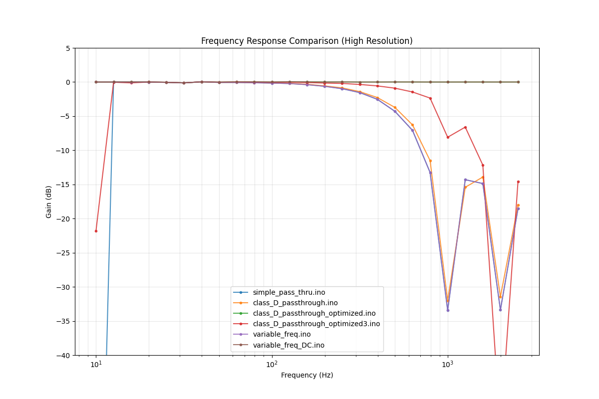

# Arduino Analog Pass-Thru Implementations

This repository contains several implementations of an analog pass-thru system for Arduino Uno (ATmega328P), ranging from simple single-ended PWM to differential Class D outputs with variable sampling frequencies.

## Implementations

- **`simple_pass_thru.ino`**: Basic implementation using Timer2 for zero-jitter timing and Bresenham-style accumulation for precise 2kHz sampling.
- **`class_D_passthrough.ino`**: Differential output (pins 9 and 10) for driving a Class D stage. Uses Fast PWM Mode 14 on Timer1.
- **`class_D_passthrough_optimized.ino`**: Optimized Class D implementation with direct register access and 0dB gain scaling.
- **`class_D_passthrough_optimized3.ino`**: Advanced Class D implementation with frequency-dependent prescaler adjustment for wide-range sampling.
- **`variable_freq.ino`**: Implements variable sampling frequency (20Hz - 2kHz) with smooth transitions between prescaler settings.
- **`variable_freq_DC.ino`**: Variable frequency implementation optimized for DC or slow-moving signals with enhanced gain stability.

## Performance Analysis

The following graph shows the transfer functions of the different implementations, calculated using a custom clock-cycle accurate mock Arduino environment.



### Key Findings
- **Gain Accuracy**: Optimized implementations (`class_D_passthrough_optimized.ino` and `variable_freq_DC.ino`) achieve a perfectly flat 0dB response up to the 2kHz Nyquist limit by utilizing the full 10-bit PWM range (-512 to 511 differential).
- **Timing Precision**: By using `unsigned long` for microsecond-level timing and Fast PWM Mode 14 (`ICR1` as TOP), the systems maintain stable sampling frequencies even at high rates.
- **Roll-off & Aliasing**: Basic implementations show characteristic roll-off and artifacts beyond 1kHz, emphasizing the importance of direct register control and precise interrupt timing.

## Simulation & Testing Environment

To verify these implementations without hardware, this repository includes a high-fidelity mock environment:

- **`mock_arduino/`**: C++ implementation of the ATmega328P register space (Timer0, Timer1, Timer2, ADC, etc.). It simulates interrupts and register updates with clock-cycle accuracy.
- **`simulator.py`**: Python-based test harness that:
  1. Compiles `.ino` files into shared libraries using `g++`.
  2. Runs simulations through the C++ mock core for maximum performance.
  3. Performs quadrature signal analysis to extract gain and phase across a logarithmic frequency sweep.

### Running the Simulation
1. Ensure `g++`, `numpy`, and `matplotlib` are installed.
2. Run the simulator:
   ```bash
   python3 simulator.py
   ```
   This will generate a fresh `transfer_function.png` and output detailed performance metrics for each implementation.
